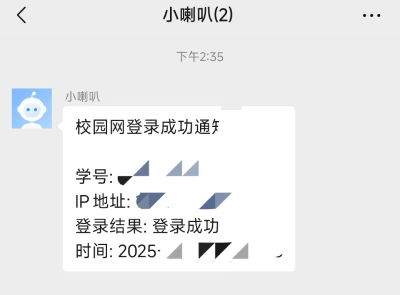

# AutoNet4AHU-MacOS - 安徽大学校园网自动登录工具 (macOS版)

这是一个用于安徽大学校园网自动登录的工具，可以在网络连接时自动进行校园网认证，避免手动登录的麻烦。专为macOS系统设计。

Author: [Biubush](https://github.com/biubush) from [AHU](https://www.ahu.edu.cn/)

## 目录

- [项目特点](#项目特点)
- [系统要求](#系统要求)
- [软件截图](#软件截图)
  - [主界面](#主界面)
  - [企业微信通知](#企业微信通知)
- [项目结构](#项目结构)
  - [登录核心模块](#1-登录核心模块-logincore)
  - [图形用户界面](#2-图形用户界面-ui)
- [技术栈](#技术栈)
- [使用方法](#使用方法)
  - [直接使用已编译程序](#直接使用已编译程序)
  - [仅使用核心模块](#仅使用核心模块)
- [配置文件说明](#配置文件说明)
- [企业微信通知配置](#企业微信通知配置)
- [安装与编译](#安装与编译)
  - [准备工作](#1-准备工作)
  - [下载项目代码](#2-下载项目代码)
  - [编译登录核心模块](#3-编译登录核心模块)
  - [编译UI模块](#4-编译ui模块)
  - [编译结果](#5-编译结果)
  - [注意事项](#注意事项-1)
- [自启动服务工作原理](#自启动服务工作原理)
- [常见问题](#常见问题)
- [注意事项](#注意事项)
- [贡献指南](#贡献指南)
- [许可证](#许可证)

## 项目特点

- **自动创建macOS启动项(LaunchAgent)，实现网络连接时自动登录**
- **图形界面客户端，全程自动化，零学习成本**
- **用户数据本地私有化，数据安全**
- 自动检测校园网连接并进行登录认证
- 支持企业微信webhook通知功能，可以接收登录状态通知
- 轻量级核心模块，可单独使用
- 使用PySide6和macOS原生设计风格，提供流畅的用户体验

## 系统要求

- macOS 10.13 (High Sierra) 或更高版本
- Python 3.8 或更高版本（如使用源码）
- 已连接到安徽大学校园网Wi-Fi或有线网络环境

## 软件截图

### 主界面


*主程序界面，用于配置学号、密码和企业微信webhook*

### 企业微信通知



*企业微信接收到的登录通知*

## 项目结构

项目主要分为两个主要模块：

### 1. 登录核心模块 (loginCore)

核心功能实现，包括：

- `main.py` - 主程序入口，处理配置加载和登录流程
- `portal.py` - 实现校园网ePortal登录功能
- `notify.py` - 通知模块，实现企业微信webhook消息推送
- `requirements.txt` - 核心模块依赖列表
- `build.sh` - 核心模块编译脚本

### 2. 图形用户界面 (UI)

使用PySide6和macOS原生设计风格的图形界面，提供友好的配置体验：

- `ui.py` - 图形界面实现，包含配置保存和macOS LaunchAgent管理
- `register_agent.sh` - 注册macOS启动项的脚本
- `unregister_agent.sh` - 卸载macOS启动项的脚本
- `com.biubush.autonet4ahu.plist` - LaunchAgent配置模板
- `ahu_eportal.py` - 用于后台运行的Python脚本
- `requirements.txt` - UI模块依赖列表
- `build.sh` - UI模块编译脚本
- `icon.icns` - 应用图标（macOS格式）

## 技术栈

- **后端**：Python，使用requests库进行HTTP请求
- **前端**：PySide6 (Qt for Python)，使用macOS原生设计风格
- **自动化**：macOS LaunchAgent服务，实现无人值守自动登录
- **通知**：企业微信webhook机器人API
- **编译工具**：PyInstaller，将Python代码编译为可执行文件

## 使用方法

### 直接使用已编译程序

1. 从[发布页面](https://github.com/biubush/AutoNet4AHU-MacOS/releases)下载最新版本
2. 解压后运行`AutoNet4AHU.app`
3. 在界面中填入学号和密码
4. 可选：添加企业微信webhook地址（用于接收登录状态通知）
5. 点击"注册启动项"按钮，将自动创建macOS启动项
6. 完成设置后，每次连接网络时将自动尝试登录校园网

### 仅使用核心模块

如果不需要图形界面，可以直接使用核心模块：

1. 在`loginCore`目录下创建`config.json`文件，格式如下：
   ```json
   {
       "student_id": "你的学号",
       "password": "你的密码",
       "webhook_urls": ["可选的企业微信webhook地址"]
   }
   ```
2. 运行`python main.py`即可登录校园网

## 配置文件说明

配置文件`config.json`包含以下字段：

- `student_id`: 学号
- `password`: 密码
- `webhook_urls`: 企业微信webhook URL列表，用于接收登录通知

配置文件示例：
```json
{
    "student_id": "S25xxxxxxx",
    "password": "your_password",
    "webhook_urls": [
        "https://qyapi.weixin.qq.com/cgi-bin/webhook/send?key=xxxxxxxx"
    ]
}
```

## 企业微信通知配置

要使用企业微信通知功能：

1. 在企业微信应用中创建一个群聊机器人
2. 复制机器人的Webhook URL
3. 将该URL填入程序配置中
4. 登录成功后，机器人将推送登录状态通知到群聊

详细说明请参考[企业微信文档](https://open.work.weixin.qq.com/help2/pc/14931#%E5%85%AD%E3%80%81%E7%BE%A4%E6%9C%BA%E5%99%A8%E4%BA%BAWebhook%E5%9C%B0%E5%9D%80)

## 安装与编译

完整的安装与编译步骤如下，使用虚拟环境进行隔离：

### 1. 准备工作

首先确保已安装Python 3.8或更高版本，并已安装pip包管理工具。

```bash
# 安装虚拟环境工具
pip install virtualenv
# 安装编译工具
pip install pyinstaller
```

### 2. 下载项目代码

```bash
git clone https://github.com/biubush/AutoNet4AHU-MacOS.git
cd AutoNet4AHU-MacOS
```

### 3. 编译登录核心模块

使用虚拟环境隔离loginCore模块依赖：

```bash
# 创建loginCore的虚拟环境
python -m virtualenv loginCore_env

# 激活虚拟环境
source loginCore_env/bin/activate

# 安装核心模块依赖
cd loginCore
pip install -r requirements.txt

# 编译核心模块
chmod +x build.sh
./build.sh
# 编译完成后会在UI目录下生成login可执行文件

# 返回项目根目录并退出虚拟环境
cd ..
deactivate
```

### 4. 编译UI模块

使用虚拟环境隔离UI模块依赖：

```bash
# 创建UI的虚拟环境
python -m virtualenv UI_env

# 激活虚拟环境
source UI_env/bin/activate

# 安装UI模块依赖
cd UI
pip install -r requirements.txt

# 编译UI模块
chmod +x build.sh
./build.sh
# 编译完成后会在项目根目录下生成AutoNet4AHU.app应用和AutoNet4AHU.dmg文件

# 返回项目根目录并退出虚拟环境
cd ..
deactivate
```

### 5. 编译结果

编译完成后，将在项目根目录下生成：
- `AutoNet4AHU.app`：可执行的macOS应用程序
- `AutoNet4AHU.dmg`：可直接分发的磁盘映像文件

编译过程中会自动：
1. 处理UTF-8编码，确保中文显示正常
2. 将登录核心模块(login)复制到应用程序包内
3. 复制启动项相关文件到应用程序包内
4. 编译完成后自动清理临时文件夹
5. 生成可分发的dmg文件

### 注意事项

- 使用虚拟环境可以避免依赖冲突问题
- 必须先编译登录核心模块，再编译UI模块
- 编译过程需要联网下载依赖
- 首次编译可能需要较长时间，请耐心等待
- 如果编译过程中出错，请检查Python环境和依赖安装情况

## 自启动服务工作原理

注册自启动服务后，macOS系统将在以下事件触发时自动运行登录程序：

1. 系统启动时
2. 网络连接状态变化时（通过网络状态监控）

这确保了在连接校园网后，自动执行登录认证，无需手动操作。程序使用macOS的LaunchAgent机制实现自启动，无需任何额外的系统权限。

## 常见问题

- **登录失败**：请检查学号和密码是否正确
- **自启动服务注册失败**：检查是否有访问~/Library/LaunchAgents的权限
- **通知未收到**：检查webhook URL是否正确，网络是否正常
- **应用无法打开**：右键点击应用，选择"打开"，然后点击"打开"按钮

## 注意事项

- 本工具仅适用于安徽大学校园网环境
- 账号密码保存在本地配置文件中，请确保计算机安全
- 如遇校园网认证系统更新，可能需要更新本工具
- 建议自行理解项目代码及其逻辑架构后自行修改编译，使用预编译的程序造成的任何损失由用户自己负责

## 贡献指南

欢迎提交Issue和Pull Request帮助改进此项目。

## 许可证

该项目采用MIT许可证发布。 